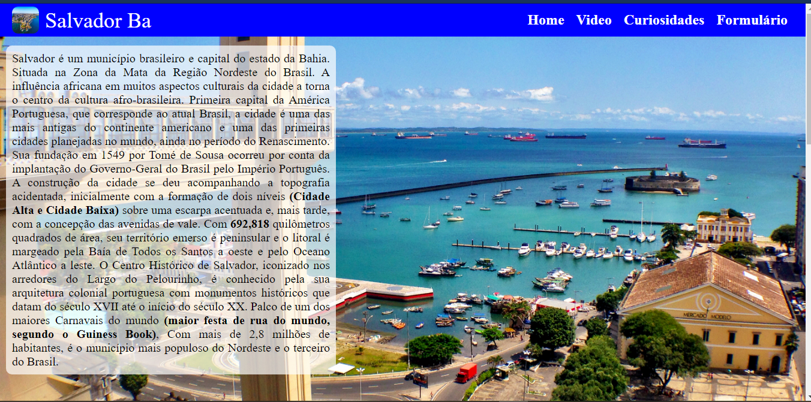
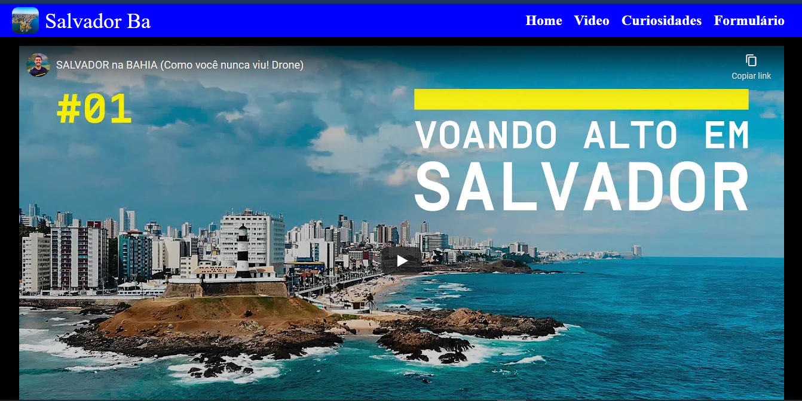
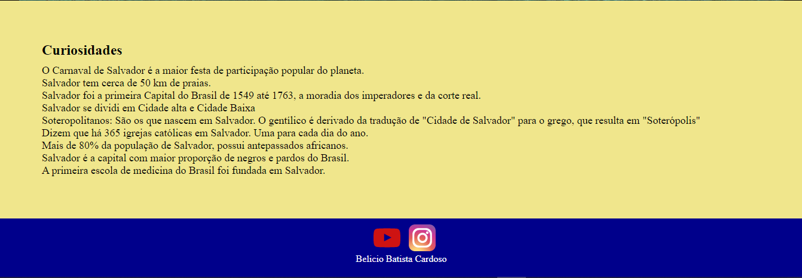
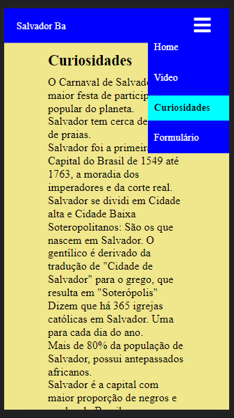
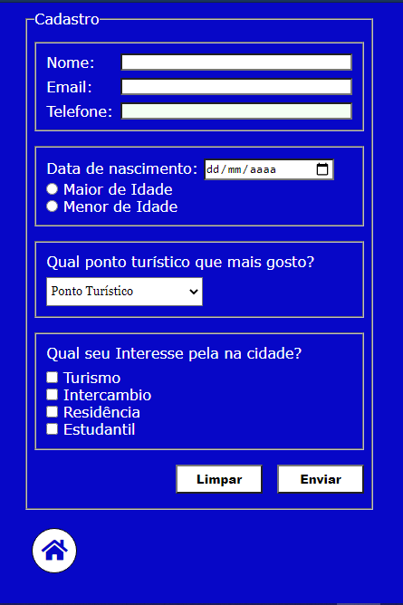
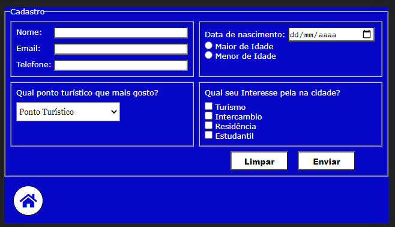

<h1>Projeto do segundo checkpoint da disciplina frontend 1 da Digital House </h1>
<h2>Descrição do projeto!</h2>

<ol type="">
<li>O formulário de cadastro deve ter no mínimo os inputs:
<ol>
<li><input type="checkbox" checked>Nome (com no máximo 100 caracteres)</li>
<li><input type="checkbox" checked>Email </li>
<li><input type="checkbox" checked>Telefone (apenas números) </li>
<li><input type="checkbox" checked>Data de nascimento (data) </li>
<li><input type="checkbox" checked>Se é maior ou menor de idade (deve ter as duas opções, podendo marcar apenas uma delas).</li>
<li><input type="checkbox" checked>Um campo que permita que o usuário selecione um ponto de interesse na sua cidade. (De uma lista de no mínimo 3).</li>
<li><input type="checkbox" checked>Um campo opcional onde o usuário poderá dizer quais seus interesses na cidade: Turista, Residente e Estudante. Note que o usuário pode escolher nenhum ou mais que um.</li>
<li><input type="checkbox" checked>O formulário deve ter um botão para enviar e um botão para resetar os dados digitados.</li>
</ol>
</li>

<li>O formulário deve ter uma animação onde quando o usuário passa o mouse sobre o campo e o campo aumenta de tamanho.</li>
<li>Você tem total liberdade para animar e colorir o seu formulário, então use e abuse da sua criatividade.</li>
</ol>

Confirar o projeto hospedado no GitHub Pages <a href="https://beliciobcardoso.github.io/checkpoint_02_frontend1/" target="_blank" rel="noreferrer noopener"> aqui</a>!

</img>
</img>
</img>
</img>
</img>
</img>

